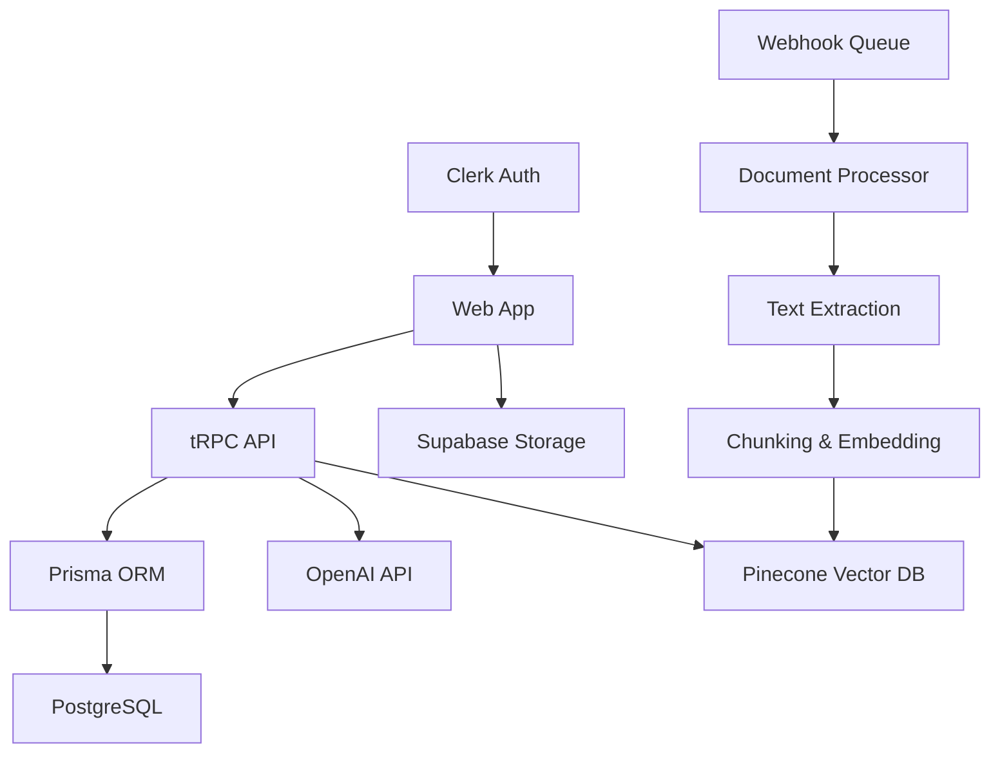

# 🔐 AuriVault [In the process of making]
> *Illuminating your knowledge, securely*

**AuriVault** is an AI-powered knowledge management platform that transforms your documents into an intelligent, searchable knowledge base. Built for teams that need secure, instant access to their institutional knowledge.


---


## 🌟 Vision

**"Every team has a goldmine of knowledge trapped in documents. AuriVault unlocks it."**

We're building the future of enterprise knowledge management - where finding information is as natural as asking a question, where insights emerge from data automatically, and where organizational knowledge becomes a strategic advantage.

---

## ✨ What Makes AuriVault Special

### 🧠 AI-First Architecture
- **Intelligent Document Processing**: Advanced OCR, text extraction, and semantic understanding
- **Vector-Based Search**: Find information by meaning, not just keywords
- **Contextual Responses**: AI provides cited, accurate answers with confidence scores
- **Multi-Modal Understanding**: Text, images, tables, and charts - all intelligently processed

---

## 🚀 Features

### 📄 Document Management
- **Universal Format Support**: PDF, DOCX, TXT, CSV, Images, and more
- **Drag & Drop Upload**: Intuitive bulk document processing
- **Version Control**: Track document changes and updates
- **Smart Organization**: AI-powered tagging and categorization
- **Preview & Annotations**: View and markup documents inline

### 🤖 AI Assistant
- **Natural Language Queries**: Ask questions in plain English
- **Cited Responses**: Every answer backed by source documents
- **Confidence Scoring**: Know how reliable each answer is
- **Multi-Document Synthesis**: Combine insights across your knowledge base
- **Export & Share**: Generate reports and summaries instantly

### 📊 Analytics & Insights [Vision]
- **Knowledge Gap Analysis**: Identify missing information
- **Usage Analytics**: See what's being searched and accessed
- **Content Performance**: Track document engagement and utility
- **Team Insights**: Understand knowledge consumption patterns
- **ROI Metrics**: Measure the value of your knowledge base

### 🔧 Enterprise Features [Future Prospectus]
- **SSO Integration**: SAML, OIDC, Active Directory
- **Role-Based Access**: Granular permissions and access controls
- **API-First**: Full REST and GraphQL APIs
- **Webhook Support**: Real-time integrations
- **White-Label Options**: Brand it as your own

---

## 🛠️ Tech Stack

### Frontend
- **Next.js 14**: React framework with App Router
- **TypeScript**: Type-safe development
- **Tailwind CSS**: Utility-first styling
- **Framer Motion**: Smooth animations
- **Lucide Icons**: Beautiful, consistent iconography

### Backend
- **tRPC**: End-to-end typesafe APIs
- **Prisma**: Modern database toolkit
- **PostgreSQL**: Robust relational database
- **Supabase**: Backend-as-a-Service for storage and auth

### AI & ML
- **OpenAI GPT-4**: Advanced language understanding
- **Pinecone**: Vector database for semantic search
- **LangChain**: AI workflow orchestration
- **Custom Embeddings**: Optimized for enterprise content

### Infrastructure
- **Vercel**: Frontend deployment and edge functions
- **Supabase**: Database and file storage
- **Clerk**: Authentication and user management
- **Upstash**: Redis for caching and sessions

---

## 🏗️ Architecture




## 🚦 Getting Started

### Prerequisites
- Node.js 18+ 
- PostgreSQL 14+
- Supabase account
- OpenAI API key
- Clerk account

### Quick Setup

1. **Clone the repository**
   ```bash
   git clone https://github.com/yourorg/aurivault.git
   cd aurivault
   ```

2. **Install dependencies**
   ```bash
   npm install
   ```

3. **Set up environment variables**
   ```bash
   cp .env.example .env.local
   # Edit .env.local with your keys
   ```

4. **Set up the database**
   ```bash
   npx prisma migrate dev
   npx prisma generate
   ```

5. **Start development server**
   ```bash
   npm run dev
   ```

6. **Open your browser**
   Navigate to `http://localhost:3000`

### Environment Variables

```env
# Database
DATABASE_URL="postgresql://..."

# Authentication
NEXT_PUBLIC_CLERK_PUBLISHABLE_KEY="pk_..."
CLERK_SECRET_KEY="sk_..."

# Storage
NEXT_PUBLIC_SUPABASE_URL="https://..."
NEXT_PUBLIC_SUPABASE_ANON_KEY="eyJ..."
SUPABASE_SERVICE_ROLE_KEY="eyJ..."

# AI
OPENAI_API_KEY="sk-..."
PINECONE_API_KEY="..."
PINECONE_INDEX_NAME="aurivault"

# Optional
WEBHOOK_SECRET="..."
REDIS_URL="redis://..."
```

---

## 📊 Current Status

### ✅ Completed Features
- **Document Upload System**: Secure, scalable file processing
- **User Authentication**: Multi-tenant organization support
- **Basic AI Chat**: Query documents with natural language
- **Responsive UI**: Modern, accessible interface
- **Real-time Updates**: Live status tracking

### 🔄 In Progress
- **Vector Search Engine**: Semantic document search
- **Advanced Text Processing**: OCR and content extraction
- **Analytics Dashboard**: Usage metrics and insights
- **API Documentation**: Comprehensive developer guides

### 📋 Next Up
- **File Preview System**: In-browser document viewing
- **Batch Processing**: Handle large document collections
- **Export Features**: Generate reports and summaries
- **Integration APIs**: Connect with third-party tools

---

## 🤝 Contributing

We're building AuriVault in the open! Whether you're fixing bugs, adding features, or improving documentation, we welcome your contributions.

### Development Workflow
1. Fork the repository
2. Create a feature branch (`git checkout -b feature/amazing-feature`)
3. Make your changes
4. Add tests if applicable
5. Commit with conventional commits (`git commit -m 'feat: add amazing feature'`)
6. Push to your branch (`git push origin feature/amazing-feature`)
7. Open a Pull Request

### Code Style
- **TypeScript**: Strict mode enabled
- **ESLint**: Airbnb configuration
- **Prettier**: Automatic code formatting
- **Husky**: Pre-commit hooks for quality

### Testing
```bash
npm run test        # Unit tests
npm run test:e2e    # End-to-end tests
npm run test:coverage # Coverage report
```

---

